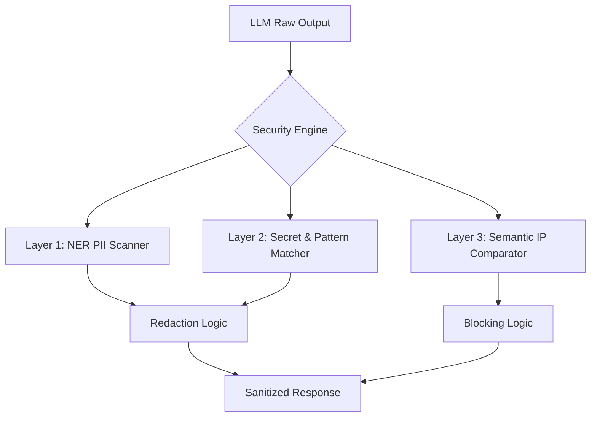

# 🛡️ LLM Data Leakage Detector & Output Guardrail


## 📖 Overview
**Sentinel-LLM** is a multi-layered security guardrail designed to detect and mitigate sensitive information disclosure in Large Language Model (LLM) outputs. This project addresses **OWASP LLM06: Sensitive Information Disclosure**, providing a programmable "security sidecar" that scans generated text for PII, secrets, and proprietary code before it reaches the end-user.


[📺 Watch the Technical Demo on Loom](https://www.loom.com/share/848661f6acec4384bc4ad4a8ac797860)

---
## 🔥 Key Security Features

Unlike traditional Data Loss Prevention (DLP) tools that rely solely on keyword matching, this detector uses a hybrid approach:

1. **AI-Powered PII Detection:** Utilizes **Named Entity Recognition (NER)** via Microsoft Presidio to identify contextual data like names, locations, and personal identifiers.

2. **Hardened Secret Scanning:** Implements high-entropy regex patterns to catch API keys, database connection strings, and authentication tokens that LLMs occasionally "hallucinate" or leak from training data.

3. **Semantic IP Guardrail:** Uses **Sentence-Transformers (Vector Embeddings)** and **Cosine Similarity** to detect when an LLM is paraphrasing or reproducing protected internal source code, even if variable names or structures have been altered.

4. **Dynamic Thresholding:** Includes an adjustable "Confidence Slider" to allow security teams to tune the balance between security (False Positives) and usability (False Negatives).

---
## 🏗️ Technical Architecture

The tool processes LLM output through three distinct security layers:


### Tech Stack

* **Core:** Python 3.11
* **NLP/NER:** Microsoft Presidio, SpaCy (en_core_web_lg)
* **Embeddings:** Sentence-Transformers (all-MiniLM-L6-v2)
* **Interface:** Streamlit

---
## 🚀 Getting Started

### Prerequisites

* Python 3.11+
* Virtual Environment (Recommended)

### Installation

1. **Clone the repository:**

```bash
git clone https://github.com/MANU-de/llm-leak-detector.git
cd llm-leak-detector
```
2. **Set up Virtual Environment:**

```bash
python -m venv venv
source venv/bin/activate  # Windows: venv\Scripts\activate
```
3. **Install Dependencies:**

```bash
pip install -r requirements.txt
python -m spacy download en_core_web_lg
```
4. **Run the Application:**

```bash
streamlit run app.py
```
---
## 🧪 Testing Scenarios

You can test the guardrail using the following simulated "risky" LLM outputs:

* **PII Leak:** "The user John Doe (j.doe@email.com) requested an update for SSN 000-11-2222."
* **Secret Leak:** "To access the production DB, use API_KEY: sk-ant-api03-abcdefg12345."
* **IP Leak:** "I will create a function called internal_secure_auth_protocol(user_id, secret_salt) for the backend."

---
## 🗺️ Roadmap (V2)

🔳 **Inbound Protection:** Integration of a Prompt Injection detector (DeBERTa-v3) to scan user inputs.

🔳 **Vector DB Integration:** Support for large-scale enterprise "Forbidden Vaults" using ChromaDB.

🔳 **Detailed Audit Logging:** Exporting security findings to JSON for ELK Stack/SIEM integration.

🔳 **API Wrapper:** FastAPI implementation for production middleware deployment.

---
## ⚖️ License

Distributed under the Apache License 2.0. See `LICENSE` for more information.

## 🤝 Contact

Manuela Schrittwieser - [LinkedIn](https://www.linkedin.com/in/manuela-schrittwieser/) - [NeuralStack | MS - Tech Blog](https://neuralstackms.tech/)

Project Link: [https://github.com/MANU-de/llm-leak-detector](https://github.com/MANU-de/llm-leak-detector)


